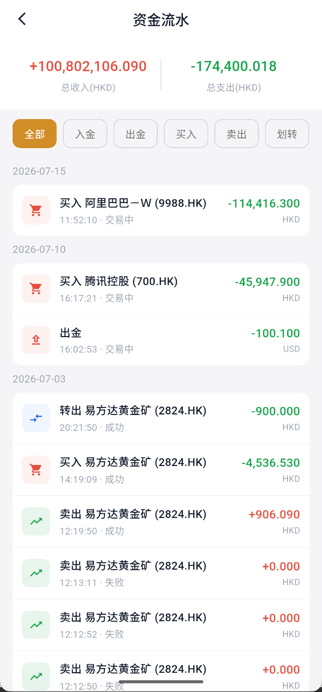

# 查看资金流水

资金流水用于核对账户资金因交易和业务处理产生的变化。

## 1. 进入流水页

进入“资产 → 流水”。

## 2. 查看收入和支出

页面顶部汇总所选计价币种的总收入和总支出。列表按日期显示业务名称、股票名称或代码、发生时间、处理状态、金额和币种。

金额前的正负号表示资金变化方向，应同时结合业务名称判断：

- 买入股票通常产生资金支出。
- 卖出股票通常产生资金收入。
- 出金、股票转让或划转会按实际处理结果显示相应变化。

## 3. 使用类型筛选

点击“全部、入金、出金、买入、卖出、划转”等类型筛选记录。筛选后仍要核对日期、币种和状态，失败或处理中记录不应当作最终到账结果。

:::warning 入金筛选不代表功能开放
流水页保留“入金”筛选项，可能用于查询历史记录或兼容不同账户状态。当前 APP 暂时不支持新建入金申请，功能状态以资产页实际业务入口和最新平台通知为准。
:::
