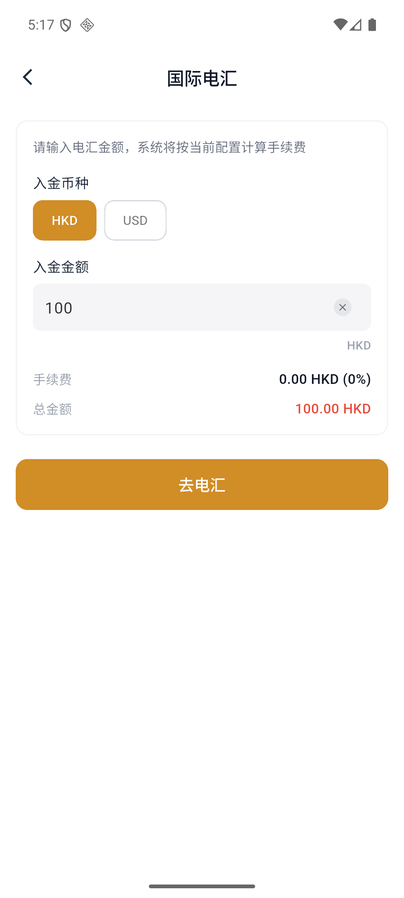
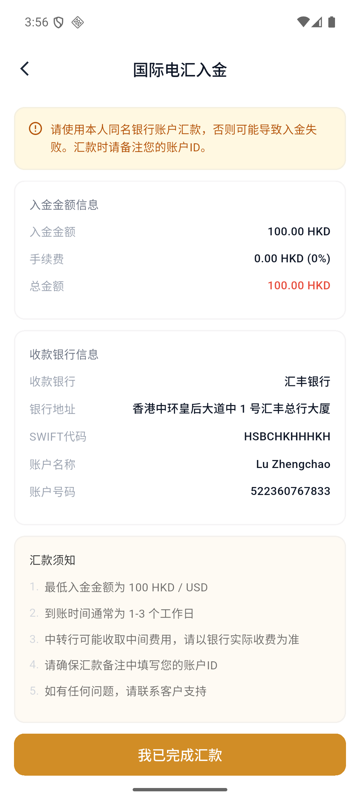
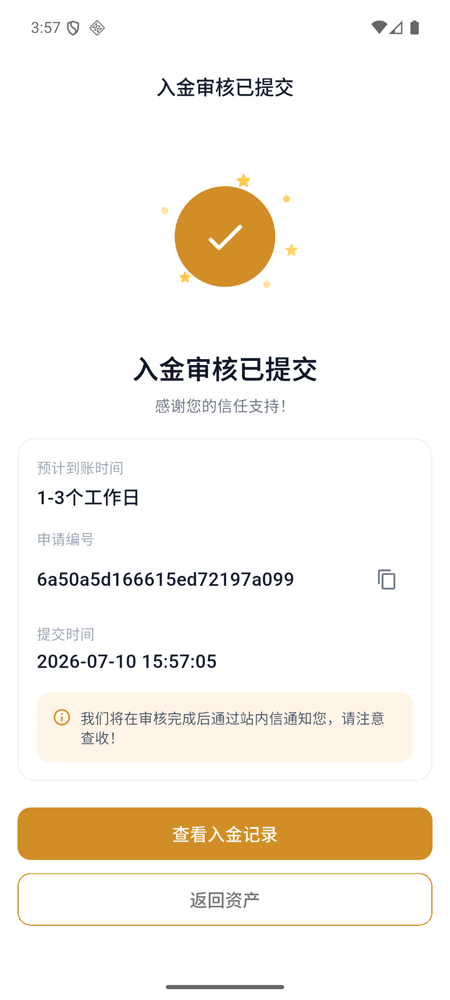

# 如何通过国际电汇入金

国际电汇支持以 HKD 或 USD 入金。提交汇款凭证后，平台通常需要 1–3 个工作日完成审核与入账。

:::info 开始前
请使用开户人本人的同名银行账户汇款。最低入金金额为 100 HKD 或 100 USD。
:::

## 1. 选择国际电汇

1. 打开 APP，进入底部的“资产”。
2. 点击“入金”。
3. 确认入金账户和 UID。
4. 点击“国际电汇”。

## 2. 填写入金金额

1. 选择 HKD 或 USD。
2. 输入入金金额。
3. 检查手续费和总金额。
4. 点击“去电汇”。

## 3. 查看收款银行信息

页面会展示收款银行、银行地址、SWIFT 代码、账户名称和账户号码。请按照页面信息从您的银行发起电汇。

:::warning 汇款注意事项
汇款备注中应填写您的 Virtu Capital 账户 ID。中转行可能另外收取费用，实际收费以汇出银行为准。
:::

## 4. 上传汇款凭证

完成银行汇款后点击“我已完成汇款”。您可以拍照或从相册选择一张电汇回单或转账成功截图。

选择图片后检查预览。如果图片不正确，可以重新拍照、重新选择或删除图片。

## 5. 提交审核

点击“提交审核”。提交成功页会显示预计到账时间、申请编号和提交时间。

## 6. 查看入金状态

点击“查看入金记录”，或从入金页面右上角进入“入金记录”。记录支持按入金方式、审核状态和入账状态筛选。

常见状态包括：

- 审核状态：待审核、已通过、已拒绝。
- 入账状态：未入账、已入账、入账失败。

