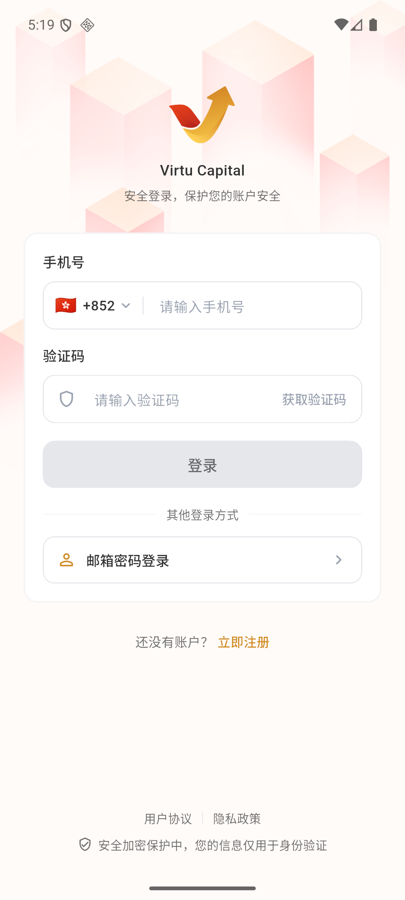

# 注册与登录

没有注册过 Virtu Capital 的新用户，应当先在登录页点击“**立即注册**”；\
注册完成后，可以使用 **手机号验证码** 或 **邮箱密码** 登录。

## 注册

### 1. 进入注册页

打开 APP，点击“开始使用”后进入 **登录界面**。

在登录页底部点击 **“立即注册”**。

### 2. 验证手机号

选择 **国家/地区码** ，输入**手机号**并获取**验证码**。

确认区号、手机号和验证码无误后，点击“下一步”。

:::warning 注意
当前仅支持香港地区手机号注册。
:::

### 3. 设置账户资料

按页面填写**昵称**、**邮箱**、**登录密码**和**六位数字交易密码**，并**勾选阅读同意用户协议与隐私政策**。

:::warning 注意
这里完成的是 APP 账户注册，不等同于证券账户开户。
:::

完成注册后返回登录页，再使用刚才注册的手机号或邮箱登录。

:::warning 验证码与密码
验证码有时效，不要向任何人提供验证码或交易密码。

多次收不到验证码时，先检查区号和手机号，再重新发送。
:::

## 登录

### 1. 打开登录页

点击“开始使用”进入登录页。

### 2. 输入手机号和验证码

选择国家/地区码，输入已经注册的手机号。

点击“获取验证码”并填写短信验证码，然后点击“登录”。

:::warning 注意
当前手机号入口仅支持香港地区手机号。
:::

:::tip 其他登录方式
完成注册后，也可以点击“**邮箱密码登录**”，\
使用注册时填写的邮箱和登录密码进入 APP。
:::
