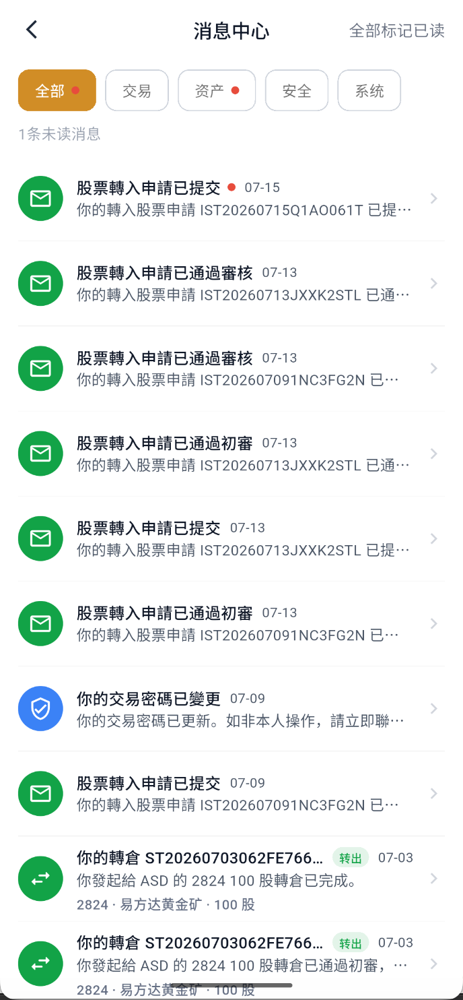

# 查看消息中心

消息中心用于集中查看交易、资产、安全和系统通知。

## 1. 进入消息中心

在“我的”页面点击右上角信封；出现红点表示存在未读消息。

## 2. 筛选消息

使用“全部、交易、资产、安全、系统”筛选消息。页面上方会显示未读数量，也可以选择“全部标记已读”。

## 3. 查看业务进度

转仓、股票转让等业务可能通过消息通知“已提交、通过初审、通过审核、已完成”等状态。点击消息查看详情时，应同时核对申请编号和 APP 业务记录，不能只凭通知标题判断最终结果。

## 4. 处理安全通知

收到密码变更或异常登录等安全消息时：

1. 先确认是否为本人操作。
2. 如果不是本人操作，立即修改登录密码和交易密码。
3. 不要向任何人提供验证码或密码，并尽快联系客户支持。

:::info 核对业务记录
请以本人页面显示的申请编号、账户信息和业务记录为准；消息标题不能代替最终处理结果。
:::
