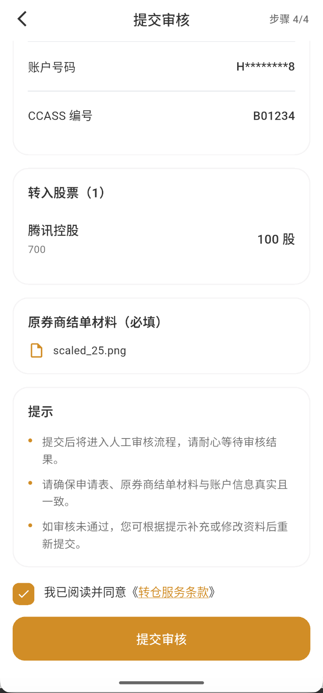
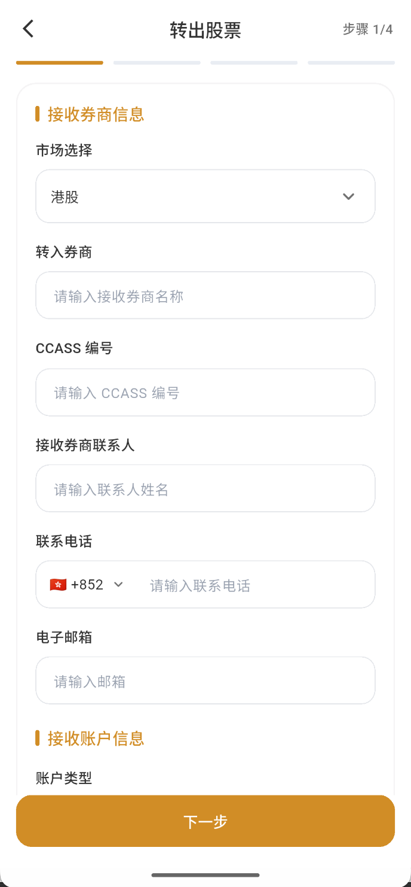
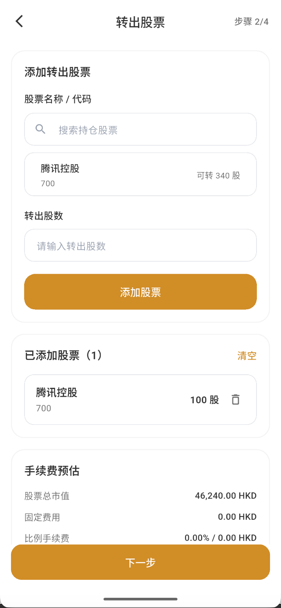
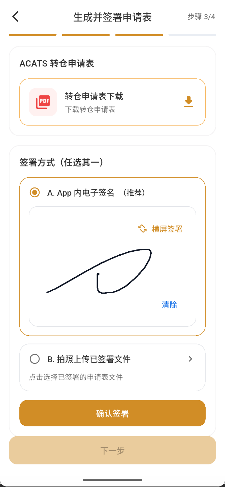
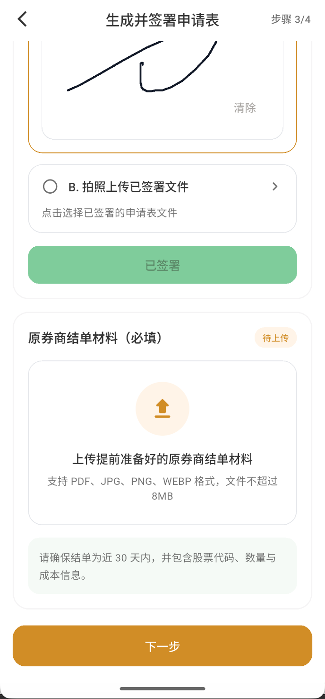
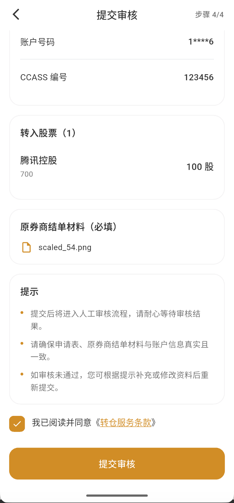

# 转入与转出股票

进入“资产 → 转仓”。“转入股票”是把其他券商的股票转至 Virtu Capital；“转出股票”是把 Virtu Capital 的股票转至其他券商。两种申请都分为四步。

## 提交前准备

请先向双方券商确认账户和交收资料。港股通常使用 CCASS 编号，美股通常使用 DTC 编号；最终以页面字段和券商答复为准。

| 项号 | 转入股票申请所需信息 | 转出股票申请所需信息 |
| --- | --- | --- |
| 1 | 客户姓名 | 客户姓名 |
| 2 | VC UID | VC UID |
| 3 | 转出券商名称 | 转入券商名称 |
| 4 | 转出券商中央结算编号（CCASS） | 转入券商中央结算编号（CCASS） |
| 5 | 转出券商联系人 | 转入券商联系人 |
| 6 | 转出券商联系人邮箱 | 转入券商联系人邮箱 |
| 7 | 转出券商联系人电话 | 转入券商联系人电话 |
| 8 | 客户在转出券商的账户号码 | 客户在转入券商的账户号码 |
| 9 | 转入股票名称 | 转出股票名称 |
| 10 | 转入股票代码 | 转出股票代码 |
| 11 | 转入股票数量 | 转出股票数量 |

还需准备券商结单和页面要求的转仓申请表。转入时，从原券商下载近期结单；转出时，从 Virtu Capital 下载结单。结单应能辨认账户姓名、股票代码、数量等信息。

:::tip 示例值
以下示例只说明填写格式：客户姓名“陈晓明”、VC UID“VC1234567890”、券商名称“示例证券有限公司”、CCASS“B01234”、联系人“王经理”、邮箱“transfer@example.com”、电话“+852 2123 4567”、券商账户“HK12345678”、股票“腾讯控股（00700）”、数量“100 股”。请勿直接复制示例。
:::

### 字段怎么填写

| 字段 | 转入股票 | 转出股票 | 示例值与注意 |
| --- | --- | --- | --- |
| 市场 | 股票当前所在市场 | 股票需要转往的市场 | 港股；美股页面可能要求 DTC，按券商答复填写 |
| 客户姓名 | 本人在转出券商登记的姓名 | 本人在转入券商登记的姓名 | 陈晓明；必须与相应券商账户持有人一致 |
| VC UID | 当前 Virtu Capital 账户 UID | 当前 Virtu Capital 账户 UID | VC1234567890；从“我的”页面核对 |
| 券商名称 | 转出券商名称 | 接收/转入券商名称 | 示例证券有限公司；填写完整公司名称 |
| CCASS/DTC | 转出券商结算编号 | 接收券商结算编号 | B01234；不要把个人证券账户号码填在这里 |
| 券商联系人 | 转出券商负责转仓的联系人 | 接收券商负责转仓的联系人 | 王经理；没有个人联系人时先向券商确认部门资料 |
| 联系人邮箱 | 转出券商转仓联系邮箱 | 接收券商转仓联系邮箱 | transfer@example.com |
| 联系人电话 | 转出券商联系电话 | 接收券商联系电话 | +852 2123 4567；区号与号码分开核对 |
| 账户类型 | 本人在转出券商的账户类型 | 本人在接收券商的账户类型 | 个人账户；按真实账户选择 |
| 券商账户号码 | 本人在转出券商的账户号码 | 本人在接收券商的账户号码 | HK12345678；它不是 VC UID 或 CCASS |
| 股票名称/代码 | 需要转入的股票 | 需要转出的股票 | 腾讯控股 / 00700 |
| 股票数量 | 需要转入的整数股数 | 需要转出的整数股数 | 100 股；不能超过持仓或可转数量 |

:::warning 同名账户与资料一致
转入、转出通常都要求两边券商账户属于同一持有人。姓名、账户号码、结单和申请表信息不一致，可能导致退回或要求补件。
:::

## 转入股票：四个步骤

### 第 1 步：填写基本信息

选择市场，填写转出券商名称、CCASS/DTC 编号、联系人姓名、电话和邮箱，再填写本人在转出券商的账户类型、账户姓名及账户号码。客户姓名和 VC UID 如由系统带入，也要逐项核对。

### 第 2 步：输入股票和数量

选择市场，搜索股票代码或名称，输入整数股数量后点击“添加”。每只股票都应出现在“已添加股票”列表中；可添加多只股票，也可在进入下一步前删除错误项目。

:::info 股票数量限制
转仓只处理股票，不处理现金；当前页面要求输入整数股，碎股不能通过此流程转仓。
:::

### 第 3 步：签署申请表并上传材料

下载系统生成的转仓申请表，可选择 APP 内电子签名，或签署后拍照上传。签名应与账户持有人一致，不要修改申请表内容。

上传原券商近期结单。当前页面提示支持 PDF、JPG、PNG、WEBP，单个文件不超过 8 MB；结单需为近 30 天，并包含股票代码、数量和成本信息。

### 第 4 步：确认并提交

逐项核对客户姓名、VC UID、市场、双方券商、联系人、结算编号、账户号码、股票代码和数量，确认申请表及结单文件可以打开。阅读并同意《转仓服务条款》后，再点击“提交审核”。

提交成功后保存申请编号，并从转仓记录查看状态。当前截图批次没有真正“提交成功”的结果页，因此本指南不使用草稿状态冒充申请成功。

## 转出股票：四个步骤

### 第 1 步：填写基本信息

填写接收股票的券商名称、CCASS/DTC 编号、联系人姓名、电话、邮箱及本人在该券商的账户类型、账户姓名和账户号码。两边账户通常需要为同一持有人。

### 第 2 步：输入股票和数量

从 Virtu Capital 当前可转持仓中选择股票，填写整数股数量。数量不得超过页面显示的可转数量。

页面会根据所选股票显示可转数量，并估算股票市值和手续费。创建草稿时不会冻结持仓和手续费；最终提交审核时，系统会重新计算并冻结。

### 第 3 步：上传材料文件

按页面下载、签署并上传申请表，同时上传当前页面要求的账户或结单材料。提交前检查文件方向正确、文字清晰、页数完整。

可选择 APP 内电子签名，或拍照上传已签署文件。测试页面显示为 ACATS 转仓申请表；实际文件名称以市场和页面为准。

完成签署后上传页面要求的结单材料。当前测试页面提示文件支持 PDF、JPG、PNG、WEBP，单个文件不超过 8 MB；材料名称和来源以 APP 当前要求为准。

### 第 4 步：确认并提交

确认接收券商、联系人、账户号码、股票、数量、手续费和材料后，阅读并同意《转仓服务条款》，再提交审核。转出申请提交后，相关股票可能被冻结，冻结期间不能卖出或重复转出。

:::caution 页面文字核对
当前测试截图的确认卡片仍显示“转入股票（1）”，与转出流程标题不一致。提交前应以页面顶部“转出股票”和实际持仓方向为准；正式版本修正后应重新截图替换。
:::

## 查看进度与撤销

从转仓页右上角进入记录，查看申请编号、方向、提交时间和处理状态。

点击“查看进度”可以查看申请时间、当前状态和处理阶段。转出流程可能依次显示“填写转仓信息、提交审核申请、VC 初审资料、VC 复审资料、待券商对账、待转出券商释放、待清算划转、已转出”。

下图是 **尚未提交审核的草稿状态**，只用于说明进度页结构，不代表申请成功：

- 状态为“当前订单尚未提交审核”时，点击“继续填写”完成剩余材料和最终确认。
- **转入股票**：在申请尚未进入券商处理前，如页面提供“撤销”，可提交取消转入；已进入交收后可能无法撤销。
- **转出股票**：在转出尚未执行前，如页面提供“撤销”，可申请取消。撤销成功后，等待系统解除相关股票冻结，再进行交易或重新申请。
- 不要重复提交相同股票和数量。没有撤销按钮或状态不明确时，应先联系客户支持。

:::info 撤销截图待补
当前截图批次没有“撤销”按钮、撤销结果或股票解冻页面。本指南仅说明判断原则，不编造具体按钮位置；后续取得真实页面后再逐步补图。
:::

:::warning 提交前最后检查
券商名称、CCASS/DTC、账户号码、股票代码或数量错误，都会造成退回或延迟。是否可撤销及解冻时间以 APP 状态和实际处理结果为准。
:::
