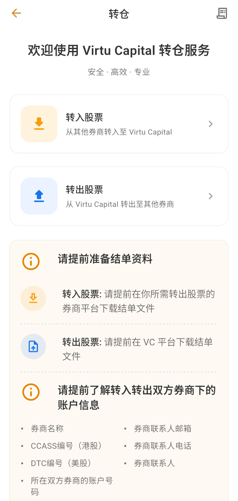
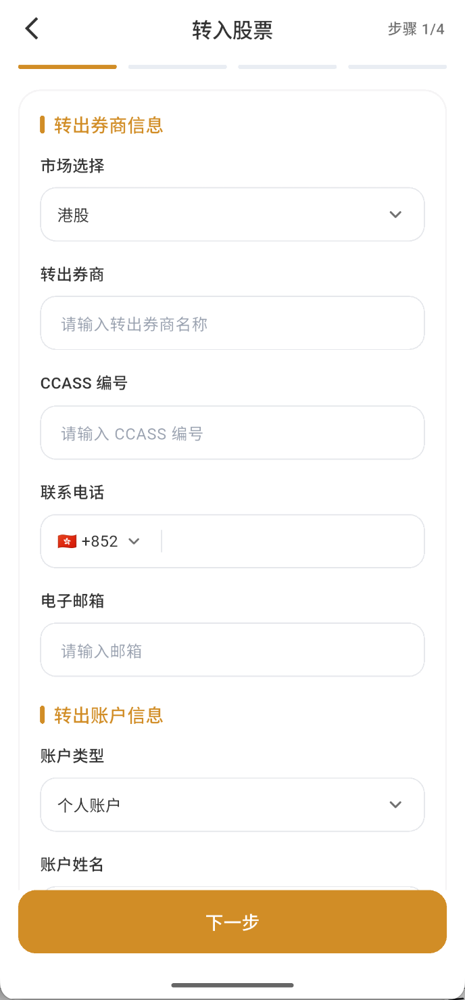
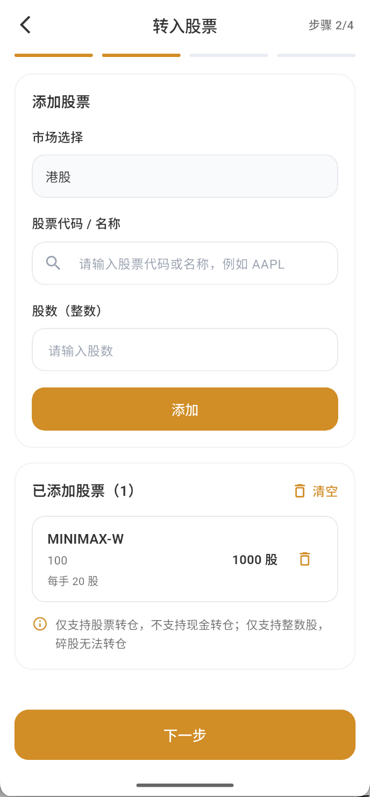
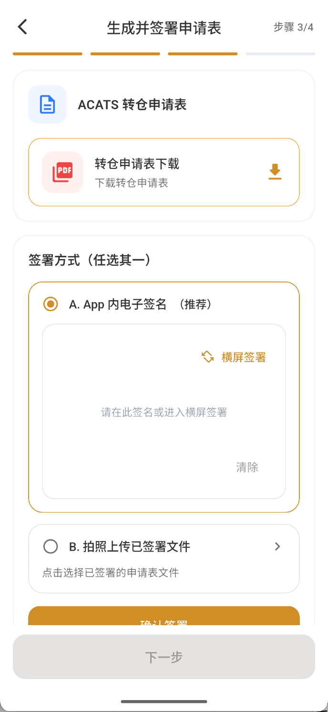
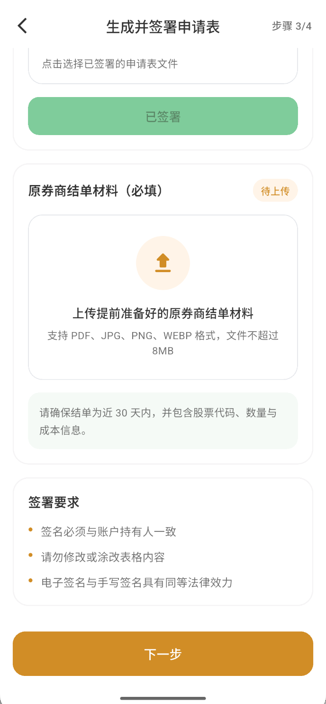
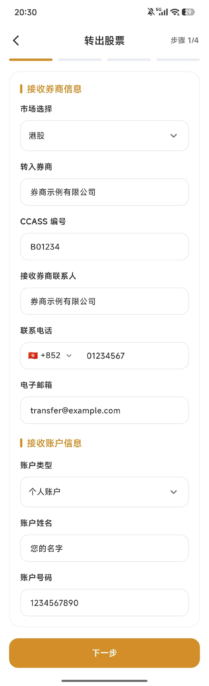
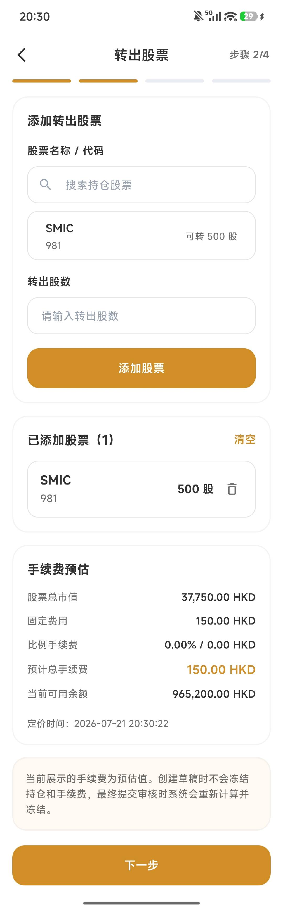
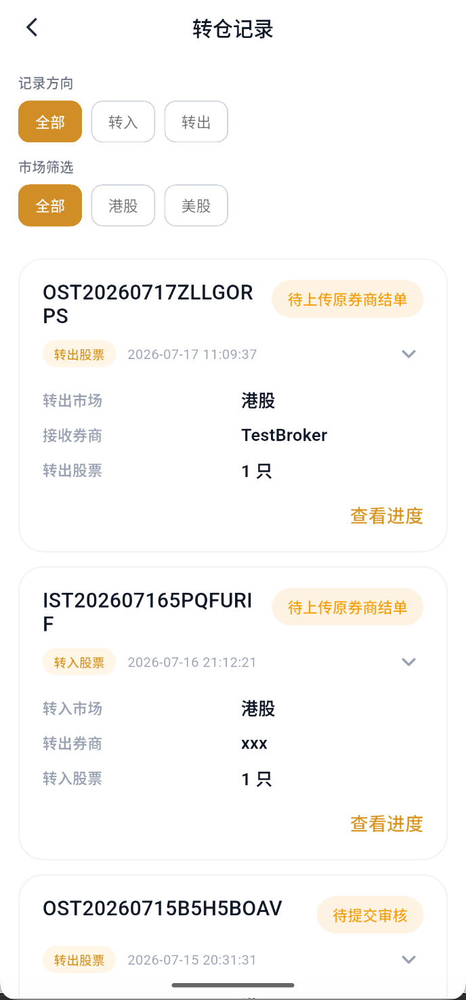
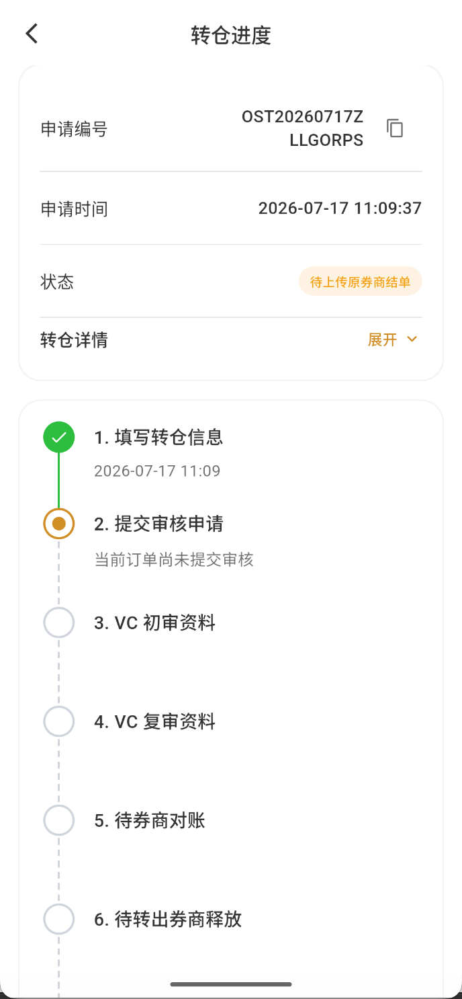

# 如何转入与转出股票

进入“资产 → 转仓”。
- “转入股票”是把其他券商的股票转至 Virtu Capital；
- “转出股票”是把 Virtu Capital 的股票转至其他券商。\
两种申请都仅需4步即可完成。

## 提交申请前准备

请先向双方券商确认**您的账户信息**、**券商联系方式**和**结单材料**。

| 项号 | 转入股票申请所需信息 | 转出股票申请所需信息 |
| --- | --- | --- |
| 1 | 您的姓名| 您的姓名 |
| 2 | VC UID | VC UID |
| 3 | 转出券商名称 | 转入券商名称 |
| 4 | 转出券商中央结算编号（CCASS或DTC） | 转入券商中央结算编号（CCASS或DTC） |
| 5 | 转出券商联系人 | 转入券商联系人 |
| 6 | 转出券商联系人邮箱 | 转入券商联系人邮箱 |
| 7 | 转出券商联系人电话 | 转入券商联系人电话 |
| 8 | 您在转出券商的账户号码 | 您在转入券商的账户号码 |
| 9 | 转入股票名称 | 转出股票名称 |
| 10 | 转入股票代码 | 转出股票代码 |
| 11 | 转入股票数量 | 转出股票数量 |

:::info
- 港股通常使用 CCASS 编号，
- 美股通常使用 DTC 编号；
:::
:::info 还需准备结单材料。
- 转入时，从原券商下载近期结单；
- 转出时，从 Virtu Capital 下载结单。\
结单应能辨认账户姓名、股票代码、数量等信息。
:::

### 字段怎么填写

| 字段 | 转入股票 | 转出股票 | 示例值与注意 |
| --- | --- | --- | --- |
| 市场 | 股票当前所在市场 | 股票需要转往的市场 | 港股；美股页面可能要求 DTC |
| 客户姓名 | 本人在转出券商登记的姓名 | 本人在转入券商登记的姓名 | 陈晓明；必须与相应券商账户持有人一致 |
| VC UID | 当前 Virtu Capital 账户 UID | 当前 Virtu Capital 账户 UID | VC1234567890；从“我的”页面核对 |
| 券商名称 | 转出券商名称 | 接收/转入券商名称 | 示例证券有限公司；填写完整券商名称 |
| CCASS/DTC | 转出券商结算编号 | 接收券商结算编号 | B01234 |
| 券商联系人 | 转出券商负责转仓的联系人 | 接收券商负责转仓的联系人 | 王经理；没有个人联系人时先向券商确认部门资料，或者填写券商名称和官方联系方式 |
| 联系人邮箱 | 转出券商转仓联系邮箱 | 接收券商转仓联系邮箱 | transfer@example.com |
| 联系人电话 | 转出券商联系电话 | 接收券商联系电话 | +852 2123 4567；区号与号码分开核对 |
| 账户类型 | 本人在转出券商的账户类型 | 本人在接收券商的账户类型 | 个人账户；按真实账户选择 |
| 券商账户号码 | 本人在转出券商的账户号码 | 本人在接收券商的账户号码 | HK12345678；VC12345678 |
| 股票名称/代码 | 需要转入的股票 | 需要转出的股票 | 腾讯控股 / 00700 |
| 股票数量 | 需要转入的整数股数 | 需要转出的整数股数 | 100 股；不能超过持仓或可转数量 |

:::warning 同名账户与资料一致
转入、转出通常都要求两边券商账户属于同一持有人。姓名、账户号码、结单和申请表信息不一致，可能导致退回或要求补件。
:::

## 转入股票：四个步骤

### 第 1 步：填写基本信息

选择股票所在市场，填写转出券商名称及 CCASS/DTC 编号，再填写转出券商的联系电话和电子邮箱，以及本人在该券商的账户类型、账户姓名和账户号码。确认资料与原券商账户及结单一致后，点击“下一步”。

:::tip 示例值
以下示例只说明填写格式：
- 市场选择：港股
- 转出券商：示例证券有限公司
- CCASS编号：B01234
- 联系电话：+852 0123 4567
- 电子邮箱：transfer@example.com
- 账户类型：个人账户
- 账户姓名：您的名字
- 账户号码：123456789
:::

### 第 2 步：输入股票和数量

根据所选择的市场，搜索股票代码或名称，输入整数股数量后点击“添加”。\
每只股票都应出现在“已添加股票”列表中；可添加多只股票，也可在进入下一步前删除错误项目。

:::info 股票数量限制
- 当前流程仅支持整数股，碎股不能通过此流程转仓。
- 转仓只处理股票，不处理现金；
:::

### 第 3 步：签署申请表并上传材料

下载页面生成的转仓申请表。申请表名称可能因所选市场而不同，以页面实际生成的文件为准。可选择 APP 内电子签名，或签署后拍照上传；签名应与账户持有人一致，不要修改或涂改申请表内容。

上传原券商近期结单。当前页面提示支持 PDF、JPG、PNG、WEBP，单个文件不超过 8 MB；结单需为近 30 天，并包含股票代码、数量和成本信息。

### 第 4 步：确认并提交

逐项核对客户姓名、VC UID、市场、双方券商、联系人、结算编号、账户号码、股票代码和数量，确认申请表及结单文件可以打开。阅读并同意《转仓服务条款》后，再点击“提交审核”。

  <figure><figcaption>确认资料并提交审核</figcaption></figure>
  <figure><figcaption>在原券商提交申请后返回确认</figcaption></figure>
  <figure><figcaption>确认完成，进入 VC 初审资料</figcaption></figure>

提交审核后，系统会生成申请编号，状态显示为“处理中”。请先前往原券商平台，为相同股票和数量提交对应的转出申请；完成后返回 VC，点击“我已在其他券商平台提交转出股票申请”。不要在尚未向原券商提交申请时提前确认。

确认后，流程会进入“VC 初审资料”，后续依次进行复审、执行转仓、股票到账及成本价补录。转仓通常需要 5–10 个工作日，具体时间取决于原券商处理速度和清算机构安排。

## 转出股票：四个步骤

### 第 1 步：填写基本信息

选择转出股票所在市场，填写接收股票的券商名称、CCASS/DTC 编号、联系人姓名、电话、邮箱及本人在该券商的账户类型、账户姓名和账户号码。\
两边账户通常需要为同一持有人。

### 第 2 步：输入股票和数量

搜索并选择 Virtu Capital 当前持仓，输入不超过页面“可转”数量的转出股数，再点击“添加股票”。在“已添加股票”中核对股票代码和数量；如有错误，可删除单只股票或清空后重填。

确认页面显示的股票总市值、预计手续费、当前可用余额和定价时间后，点击“下一步”。当前手续费仅为预估值；创建草稿不会冻结持仓和手续费，最终提交审核时系统会重新计算并冻结。

### 第 3 步：生成并签署申请表，上传结单

先下载系统生成的转仓申请表，并在两种签署方式中任选一种：使用 APP 内电子签名，或在文件签署后拍照上传。电子签名完成后点击“确认签署”，页面显示“已签署”后继续。

随后上传页面要求的原券商近期结单。请确认上传的是结单而不是申请表；结单应为近 30 天，并包含股票代码、数量和成本信息。文件格式和大小限制以 APP 当前提示为准。

  <figure><figcaption>下载并签署转仓申请表</figcaption></figure>
  <figure><figcaption>完成签署并上传原券商结单材料</figcaption></figure>

### 第 4 步：确认并提交

核对市场、接收券商、账户姓名、账户号码、CCASS/DTC、转出股票、数量和上传材料。确认资料真实且一致后，阅读并同意《转仓服务条款》，再点击“提交审核”。提交时系统会重新计算相关费用并冻结相应持仓；冻结期间不能卖出或重复转出。

  <figure><figcaption>核对转仓资料并提交审核</figcaption></figure>
  <figure><figcaption>提交成功并查看转出进度</figcaption></figure>

提交成功后保存申请编号，并在转仓记录中查看进度。页面显示“待审核”仅代表申请已经提交；完成 VC 初审、复审、券商对账、转出券商释放及清算划转后，状态才会变为“已转出”。页面提示转仓通常需要 5–10 个工作日。

## 查看进度与撤销

从转仓页右上角进入记录，查看申请编号、方向、提交时间和处理状态。

点击“查看进度”可以查看申请时间、当前状态和处理阶段。转出流程可能依次显示“填写转仓信息、提交审核申请、VC 初审资料、VC 复审资料、待券商对账、待转出券商释放、待清算划转、已转出”。

申请尚未提交审核时，进度页会显示以下草稿状态：

- 状态为“当前订单尚未提交审核”时，点击“继续填写”完成剩余材料和最终确认。
- **转入股票**：处理中的申请如显示“撤销转仓”按钮，可以按当前状态发起撤销；已进入交收后可能无法撤销。
- **转出股票**：在转出尚未执行前，如页面提供“撤销”，可申请取消。撤销成功后，等待系统解除相关股票冻结，再进行交易或重新申请。
- 不要重复提交相同股票和数量。没有撤销按钮或状态不明确时，应先联系客户支持。

:::warning 提交前最后检查
券商名称、CCASS/DTC、账户号码、股票代码或数量错误，都会造成退回或延迟。是否可撤销及解冻时间以 APP 状态和实际处理结果为准。
:::
