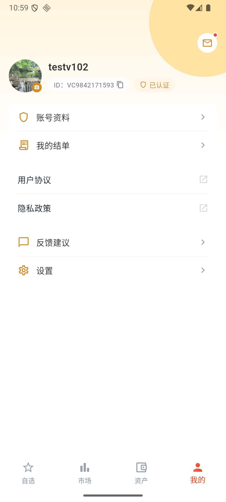

# 使用“我的”页面

“我的”是账户支持功能的总入口，不是单独的业务大类。

页面可查看昵称、VC UID 和认证状态，并进入：

- **账户资料**：查看和维护个人账户信息。
- **我的结单**：筛选、下载或发送日结单和月结单。
- **用户协议与隐私政策**：查看当前协议文件。
- **反馈建议**：提交业务反馈或产品反馈。
- **设置**：调整语言、行情颜色等偏好。

:::tip 先确认认证状态
部分资产和交易功能仅对已完成开户及认证的账户开放。入口缺失时，先查看页面上的认证状态。
:::
