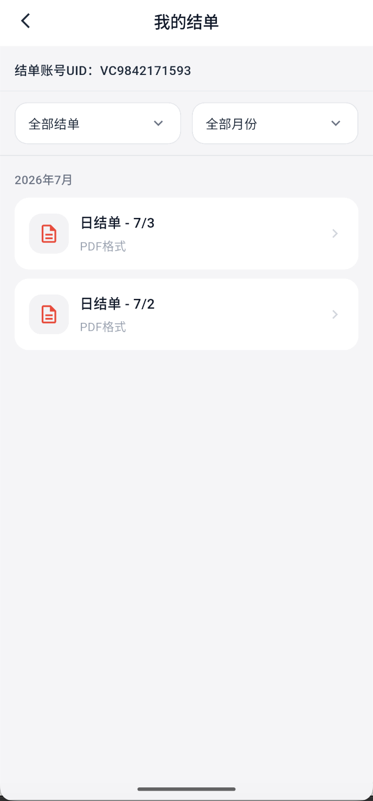
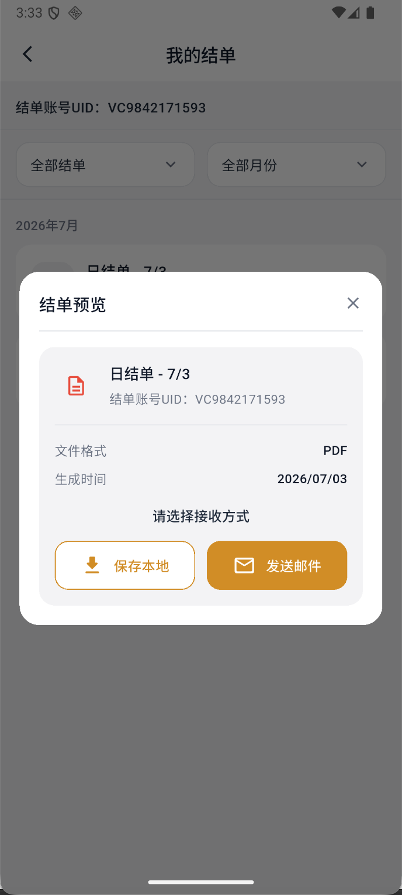

# 查看与获取结单

结单是账户业务记录文件，可用于核对交易、持仓和转仓资料。

## 1. 进入结单页

进入“我的 → 我的结单”。页面顶部会显示结单账户 UID。

## 2. 筛选结单

使用左侧下拉框选择全部结单、日结单或月结单；使用右侧下拉框选择月份。等待列表加载完成后再选择文件。

- **日结单**：按交易日生成，适合核对某一天的账户记录。
- **月结单**：按月份汇总，适合查看较长周期的账户记录。

没有显示结果时，先确认结单类型和月份是否正确，再等待列表加载，不要连续反复切换筛选项。

## 3. 预览并获取

点击一条结单，核对结单类型、日期、UID和文件格式。PDF 可选择：

- **保存本地**：下载到当前设备。
- **发送邮件**：发送到页面确认的邮箱。

两种方式只是选择如何接收现有结单，不会重新生成一份新的结单。

:::warning 文件安全
结单含账户和资产信息。下载后妥善保管，不要发送给不相关人员；用于转仓时，只提交到确认无误的券商或平台页面。
:::
