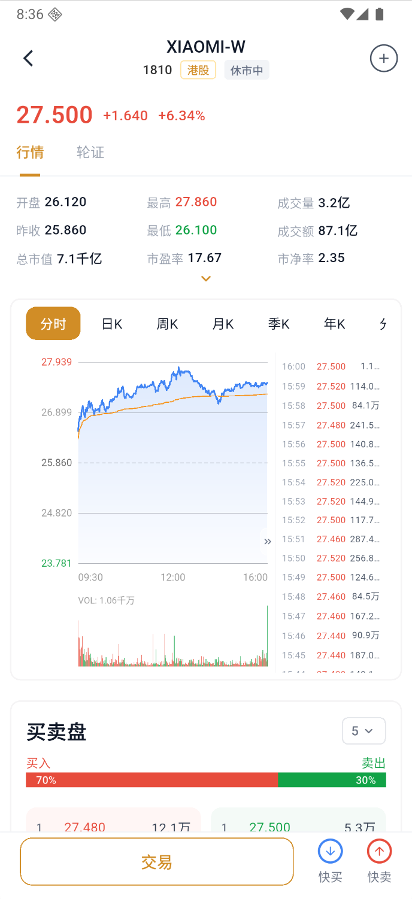

# 查看股票详情

股票详情页包含最新价、涨跌幅、开盘/最高/最低、成交量、成交额、估值数据、图表、逐笔成交和买卖盘。

### 1. 打开股票详情

从自选或市场页点击股票。

以下以小米集团-W（1810）页面为例。截图中的价格和涨跌幅仅用于说明界面，不是实时行情或投资建议。

### 2. 查看行情和图表

在“行情/轮证”之间切换，并选择“分时、日K、周K、月K”等周期：

- 分时图用于查看当日价格变化和成交节奏。
- 日K、周K、月K用于观察不同时间尺度的开盘、最高、最低和收盘价格。
- 成交量需要与价格变化一起看；单独放量或缩量不能直接等同于买入、卖出信号。

### 3. 查看买卖盘和资金信息

买卖盘显示不同报价档位的委托价格和数量。买一、卖一只是当前最接近成交的报价，不保证下一笔一定按该价格成交。

页面若展示资金流向，应结合统计周期、成交量和价格变化判断。资金净流入或净流出是成交数据的分类结果，不等于未来涨跌结论。

### 4. 进入交易

查看买卖盘后，点击“交易”“快买”或“快卖”。

### 5. 管理自选

点击右上角图标加入或移除自选。
