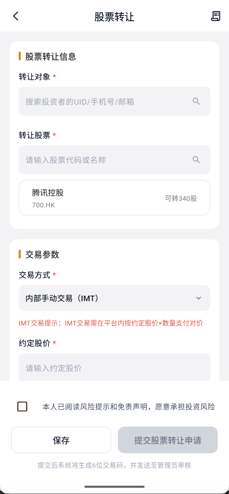
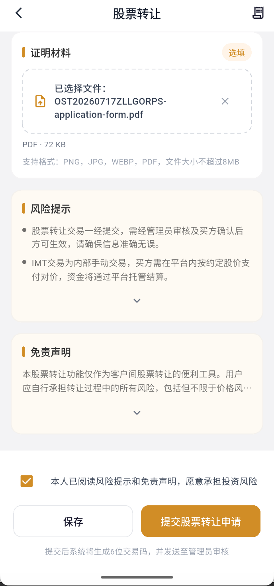
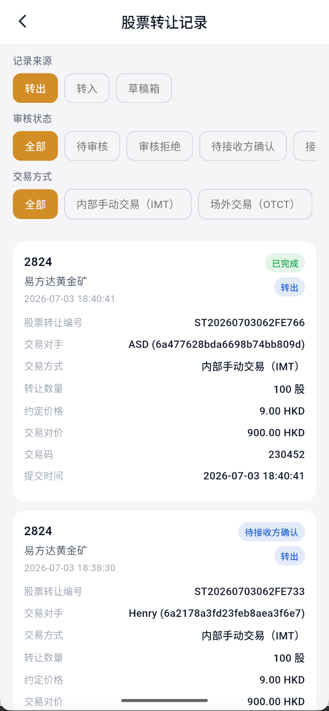

# 平台内股票转让

平台内股票转让用于两位 Virtu Capital 客户之间转让股票，不是把股票转至其他券商。转让方和接收方都必须是已开户的 VC 客户。

## 先理解交易类型

| 业务术语 | APP 当前文字 | 含义 | 页面中的对价 |
| --- | --- | --- | --- |
| MIT | 部分页面显示“IMT（内部手动交易）” | 平台内部结算。双方约定股价，由平台按“约定股价 × 数量”计算对价并完成内部股票与资金结算 | 约定股价 × 数量 |
| OTC | 部分记录筛选显示“OTCT” | 场外交易。APP 内只处理股票转让，资金由双方在场外按约定结算 | 显示为 0 |

:::caution 术语以业务规则为准
业务规则使用 MIT、OTC；当前测试版个别页面显示 IMT、OTCT。它们的页面文字仍待产品统一，操作时应同时核对“是否平台内结算”和“页面对价”，不要只看缩写。
:::

BSN 是支持本次转让的业务证明材料。业务要求本次申请提供 BSN，请上传真实、清晰且能对应双方、股票和交易安排的证明。当前测试页面可能把材料标为“选填”，正式办理仍以最新业务要求为准。

## 操作步骤

### 1. 进入股票转让页

进入“资产 → 股票转让”。

### 2. 选择接收方

使用接收方 VC UID、手机号或邮箱搜索，并与对方再次核对姓名和完整 UID。不要仅凭昵称判断接收方身份。

### 3. 选择股票和交易类型

搜索股票代码或名称，选择持仓并输入不超过“可转数量”的整数股。再选择 MIT 或 OTC：

- MIT：填写双方约定股价，核对系统计算的对价。示例：腾讯控股（00700）100 股、约定股价 9.00 HKD，页面对价应为 900.00 HKD。
- OTC：页面对价应为 0；双方自行完成场外资金结算，并保留相关证明。

### 4. 上传 BSN 并确认

上传 BSN 证明，检查接收方、股票代码、数量、交易类型、约定股价和对价。展开阅读风险提示及免责声明并勾选确认，然后选择“保存”草稿或“提交股票转让申请”。

:::info 材料截图说明
截图仅用于指出材料上传和风险提示的位置，图中的演示文件名不代表合格的 BSN 内容。请以最新业务要求准备实际证明。
:::

### 5. 保存交易信息并等待处理

提交后系统会生成申请编号或六位交易码。妥善保存，接收方可能需要确认，平台也可能进行审核。不要把交易码发送给无关人员，也不要重复创建相同接收方、股票和数量的申请。

从页面右上角进入“股票转让记录”，可以按转出/转入、审核状态和交易方式筛选，并查看交易对手、数量、约定价格、对价和当前状态。

## 提交后的冻结与撤销

- 仅保存草稿时是否冻结，以记录页和可用持仓/余额显示为准。
- MIT 申请提交后，为保证结算，转让方股票和接收方相应资金可能被冻结。
- OTC 申请提交后，转让方股票可能被冻结；APP 内不会按对价划转资金。
- 在申请尚未进入审核、匹配或结算前，如果记录页提供“撤销”，可发起撤销。
- 撤销成功后，再等待股票或资金解除冻结。已开始结算、已完成或页面无撤销入口时，不要重复提交，应联系客户支持。

:::info 撤销与冻结截图待补
当前截图批次没有冻结明细、接收方确认或撤销按钮。本页保留业务判断原则，后续取得真实页面后再补充具体入口和每一步截图。
:::

:::warning 安全提示
只向已核实身份的 VC 客户转让股票。提交前确认 UID、股票、数量、MIT/OTC 类型和 BSN 文件；不要因对方催促而绕过核验，也不要向任何人提供验证码、登录密码或交易密码。OTC 的场外收付款风险由交易双方自行核实和承担。
:::
