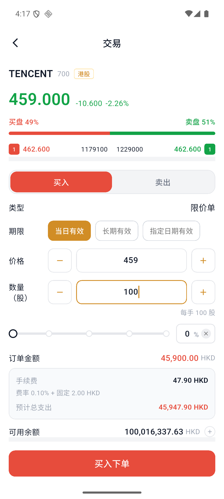

# 如何买入和卖出股票

## 开始前

- 确认账户已完成开户并有足够的对应币种余额。
- 港股通常按每手股数交易，订单页会显示“每手”数量。
- 限价单只限定成交价格，不保证一定成交。

## 1. 找到股票

进入“市场”或“自选”，搜索股票代码或名称，也可以从热门股票列表进入。点击股票后进入行情详情页。

## 2. 进入交易页

点击底部“交易”。如果只需要快速下单，也可以选择“快买”或“快卖”。

## 3. 选择买入或卖出

在订单页选择“买入”或“卖出”，然后确认：

| 字段 | 说明 |
| --- | --- |
| 订单类型 | 当前页面为限价单 |
| 有效期 | 当日有效、长期有效或指定日期有效 |
| 价格 | 买入时表示愿意支付的最高价格；卖出时表示愿意接受的最低价格 |
| 数量 | 输入股数，并留意每手股数要求 |

四种入口的区别如下：

| 操作 | 适用场景 | 提交前重点检查 |
| --- | --- | --- |
| 交易买入 | 在完整订单页设置买入价格、数量和有效期 | 可用余额、每手股数、预计总支出 |
| 交易卖出 | 在完整订单页设置卖出价格、数量和有效期 | 当前持仓、可卖数量、预计到账 |
| 快买 | 在股票详情页快速填写买入价格和数量 | 订单金额、手续费、市场状态 |
| 快卖 | 在股票详情页快速填写卖出价格和数量 | 当前持仓、手续费、市场状态 |

<table>
  <tbody>
    <tr>
      <td> <strong>交易买入</strong></td>
      <td> <strong>交易卖出</strong></td>
    </tr>
    <tr>
      <td> <strong>快买</strong></td>
      <td> <strong>快卖</strong></td>
    </tr>
  </tbody>
</table>

## 4. 检查金额和费用

提交前检查订单金额、手续费、预计总支出和可用余额。

:::warning 限价单不保证成交
买入限价单只会按指定价格或更低价格成交；卖出限价单只会按指定价格或更高价格成交。如果市场没有达到限价，订单可能保持“已提交”或到期未成交。
:::

## 5. 提交订单

点击“买入下单”或“卖出下单”。看到下单成功提示后，点击“确认”。

## 6. 查看订单状态

进入“资产”，点击“订单”。可以使用状态、买卖方向和订单类型筛选，也可以搜索订单号、股票代码和股票名称。

订单列表会显示订单价格、股数、金额、已成交数量和当前状态。

### 常见状态

- 已提交：订单已经进入系统，尚未全部成交。
- 已成交：订单股数已经全部成交。
- 部分成交：只有部分股数成交，剩余部分仍可能继续等待成交。
- 已取消：订单已经撤销，不会继续成交。
