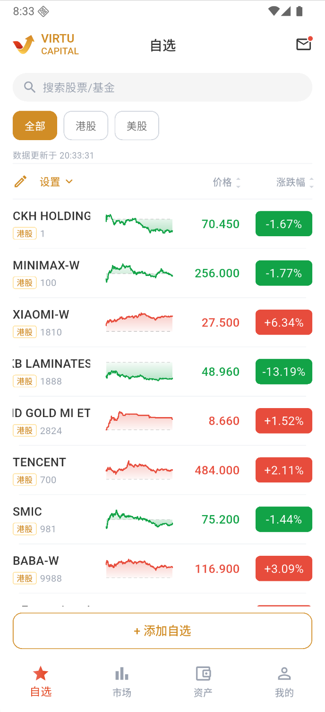
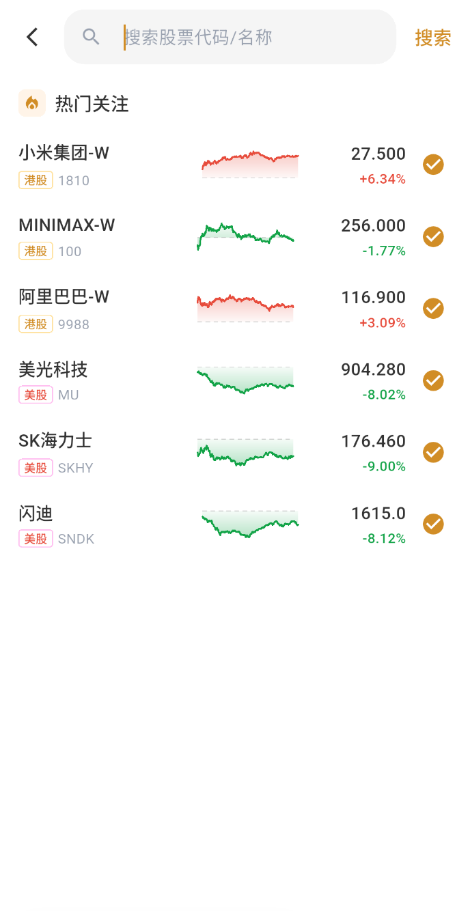

# 管理自选股

### 1. 进入自选页

进入底部“自选”。

### 2. 添加自选股

点击“+ 添加自选”或顶部搜索框，输入股票代码或名称。搜索页的“热门关注”可用于发现近期关注度较高的股票；它只反映页面推荐，不代表适合所有用户。

搜索结果右侧的黄色勾选表示股票已经加入自选；再次点击可以移除。也可以进入股票详情后点击右上角图标操作。

### 3. 打开行情详情

自选列表会显示市场标签、股票代码、最新价、涨跌幅、分时走势和数据更新时间。点击股票行可以直接打开行情详情和交易入口；不要把右侧勾选按钮当作进入详情的入口。

### 4. 管理自选列表

使用“港股/美股”筛选市场。点击“设置”调整排序，或进入编辑模式删除标的。
