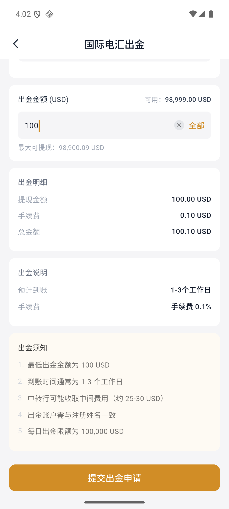
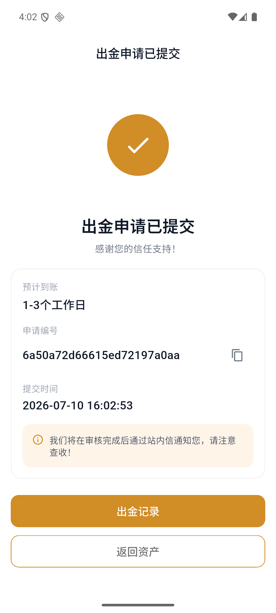
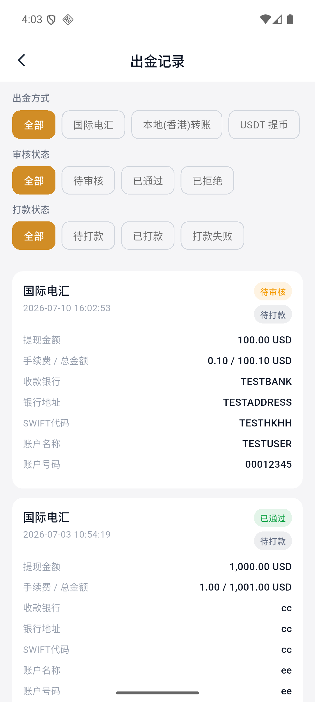

# 如何出金

国际电汇出金支持将 USD 提取至本人同名银行账户，通常需要 1–3 个工作日。

:::warning 开始前
收款账户名称必须与 Virtu Capital 开户姓名一致。国际电汇可能产生中转行费用。
:::

## 1. 选择国际电汇

打开 APP，进入底部的“资产”。点击“出金”后，确认出金账户，再选择“国际电汇”。

## 2. 填写收款银行资料

依次填写收款银行、银行地址、SWIFT 代码、账户名称和账户号码。

## 3. 填写出金金额

输入出金金额，或点击“全部”填写最大可提现金额。页面会自动计算手续费和账户实际扣除的总金额。

国际电汇最低出金金额为 100 USD，页面显示的手续费率为 0.1%。

## 4. 确认并提交

点击“提交出金申请”，再次确认填写的信息正确，然后点击“确认提交”。

## 5. 保存申请编号

提交成功页会展示预计到账时间、申请编号和提交时间。建议保留申请编号以便查询。

## 6. 查看出金状态

从成功页点击“出金记录”，或从出金页面右上角进入记录页。记录支持按出金方式、审核状态和打款状态筛选。

常见状态包括：

| 状态类型 | 常见状态 |
| --- | --- |
| 审核状态 | 待审核、已通过、已拒绝 |
| 打款状态 | 待打款、已打款、打款失败 |

