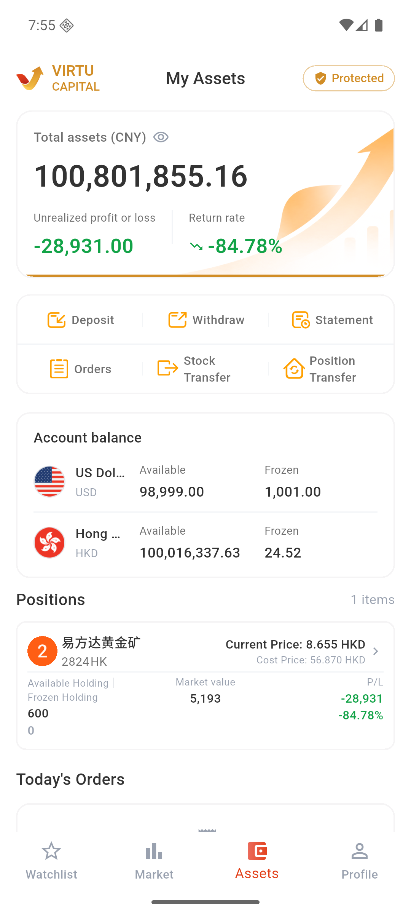

# View account assets

### 1. Enter the assets page

Go to the bottom "Assets".

### 2. View asset overview

View total assets, unrealized gains and losses, and profitability. Click the eye icon to hide or show the amount.

### 3. View balance and positions

Check the available and frozen amounts of each currency in "Account Balance"; check the number, cost, current price, market value and profit and loss of stocks in "Positions".

### 4. Use the quick entry

Enter deposits, withdrawals, bills, orders and transfers from the quick entry on the asset page.
