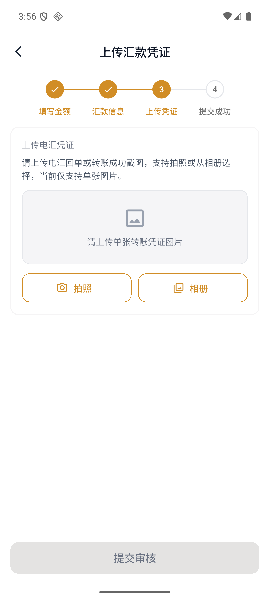
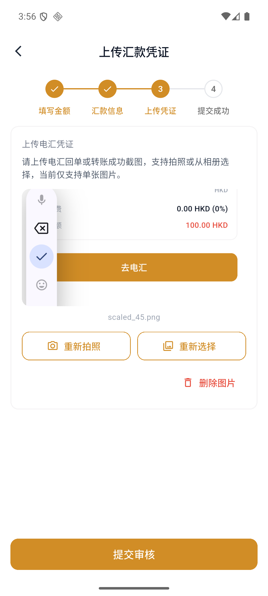

# How to deposit money via international wire transfer

International wire transfer supports deposits in HKD or USD. After submitting the remittance voucher, the platform usually takes 1–3 working days to complete the review and credit.

:::info before starting
Please use the bank account with the same name of the account holder to remit funds. The minimum deposit amount is 100 HKD or 100 USD.
:::

## 1. Select international wire transfer

Open the APP and enter "Assets" at the bottom. After clicking "Deposit", confirm the deposit account and UID, and then select "International Wire Transfer".

## 2. Fill in the deposit amount

Select HKD or USD and enter the deposit amount. After checking that the handling fee and total amount are correct, click "Go to wire transfer".

## 3. Check the beneficiary bank information

The page will display the beneficiary bank, bank address, SWIFT code, account name and account number. Please follow the information on the page to initiate a wire transfer from your bank.

:::warning Remittance Notes
Your Virtu Capital account ID should be filled in the remittance notes. The intermediary bank may charge additional fees, and the actual fees are subject to the remitting bank.
:::

## 4. Upload remittance voucher

After completing the bank transfer, click "I have completed the transfer". You can take a photo or select a wire transfer receipt or a screenshot of a successful transfer from the photo album.

Check the preview after selecting the image. If the picture is incorrect, you can retake the picture, reselect it, or delete it.

## 5. Submit for review

Click "Submit for review." The submission success page will display the expected arrival time, application number and submission time.

## 6. Check deposit status

Click "View Deposit Records" or enter "Deposit Records" from the upper right corner of the deposit page. Records support filtering by deposit method, review status, and accounting status.

Common statuses include:

| Status Type | Common Status |
| --- | --- |
| Review status | Pending review, passed, rejected |
| Accounting status | Not accounted, accounted, account failed |

