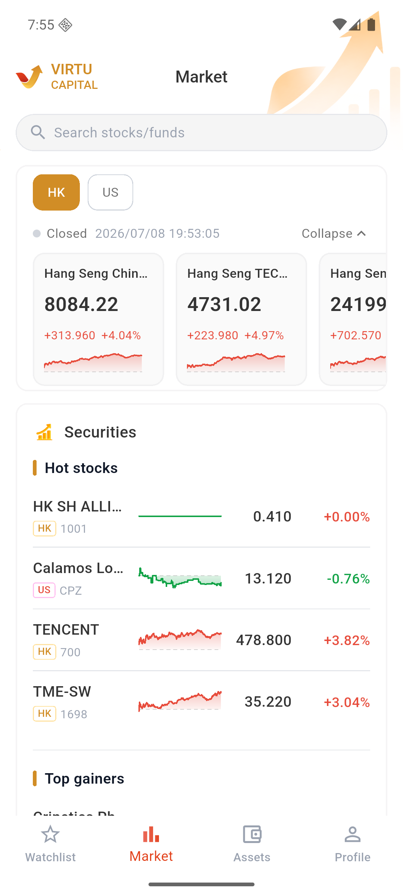

# Check market conditions

### 1. Enter the market page

Enter the bottom "market".

The market page will display the market status and update time; you can still check the market conditions and prepare orders during the market break.

### 2. Select the market

Select "Hong Kong Stocks" or "US Stocks" and slide the index card horizontally to view other indices.

### 3. Search or browse stocks

Find a stock or fund in the search box, or enter stock details from the "Top Stocks" or "Leading Gainers" lists.
