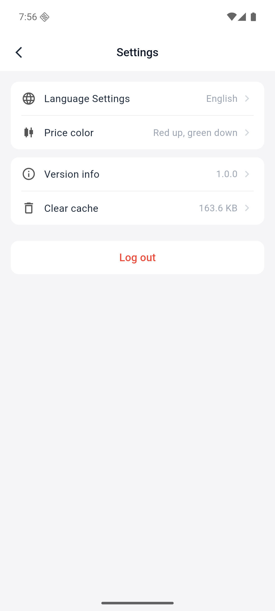

# Set language and preferences

### 1. Enter the settings page

Go to "My → Settings".

### 2. Switch language

Switch to Simplified Chinese, Traditional Chinese or English in "Language Settings", and the switch will take effect immediately.

### 3. Set display preferences

Select the price color preference in "Rise and Fall Color"; you can also check the version information and click "Clear Cache" when abnormal.

### 4. Log out

Click "Log out" to leave the current account.
