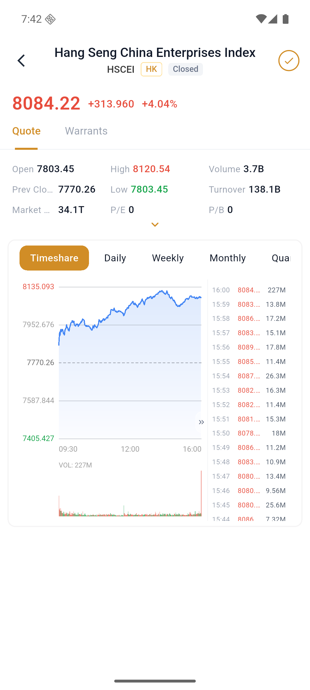

# View stock details

The stock details page includes the latest price, increase and decrease, opening/highest/lowest, trading volume, trading value, valuation data, charts, transactions and orders.

### 1. Open stock details

Click on a stock from the Select or Market page.

### 2. Check the market and charts

Switch between "Quotes/Rotations" and switch between "time-sharing, daily K, weekly K, monthly K" and other cycles.

### 3. Enter transaction

After viewing the buy and sell order, click "Trade", "Quick Buy" or "Quick Sell".

### 4. Management options

Click the icon in the upper right corner to add or remove your own selections.
