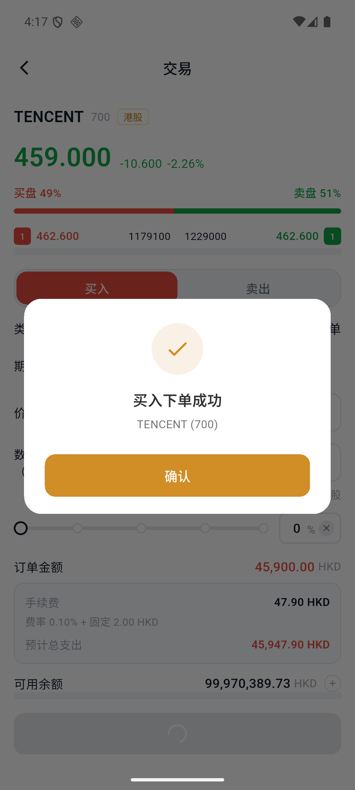
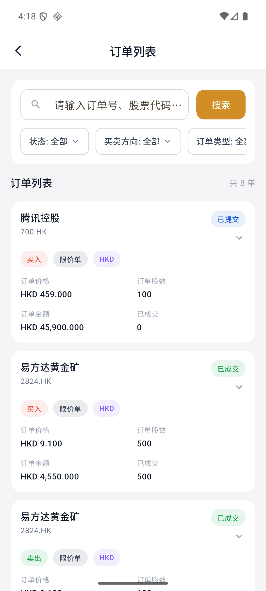

# How to buy and sell stocks

## Before starting

- Confirm that the account has been opened and has sufficient balance in the corresponding currency.
- Hong Kong stocks are usually traded based on the number of shares per lot, and the "per lot" quantity will be displayed on the order page.
- A limit order only limits the transaction price and does not guarantee a transaction.

## 1. Find the stock

Enter "Market" or "Search" to search for stock codes or names, or enter from the popular stock list. Click on the stock to enter the market details page.

## 2. Enter the transaction page

Click "Trade" at the bottom. If you just need to place an order quickly, you can also choose "Quick Buy" or "Quick Sell".

## 3. Select Buy or Sell

Select "Buy" or "Sell" on the order page and confirm:

| Field | Description |
| --- | --- |
| Order type | The current page is a limit order |
| Validity period | Valid on the same day, valid for a long time, or valid on a specified date |
| Price | The highest price you are willing to pay when buying; the lowest price you are willing to accept when selling |
| Quantity | Enter the number of shares and pay attention to the requirements for the number of shares per lot |

## 4. Check amounts and fees

Check your order amount, fees, estimated total spend, and available balance before submitting.

:::warning Limit orders do not guarantee execution.
Buy limit orders will only be executed at the specified price or lower; sell limit orders will only be executed at the specified price or higher. If the market does not reach the limit price, the order may remain "Submitted" or expire unfilled.
:::

## 5. Submit order

Click "Place Buy Order" or "Place Sell Order". After seeing the successful order prompt, click "Confirm".

## 6. Check order status

Go to "Assets" and click "Orders". You can filter by status, buy/sell direction, and order type, or search by order number, ticker symbol, and stock name.

The order list will display the order price, number of shares, amount, completed quantity and current status.

### Common status

- Submitted: The order has been entered into the system but has not yet been fully completed.
- Completed: All the shares in the order have been completed.
- Partially executed: Only part of the shares are executed, and the remaining shares may still be waiting for execution.
- Canceled: The order has been cancelled, and the transaction will not continue.
