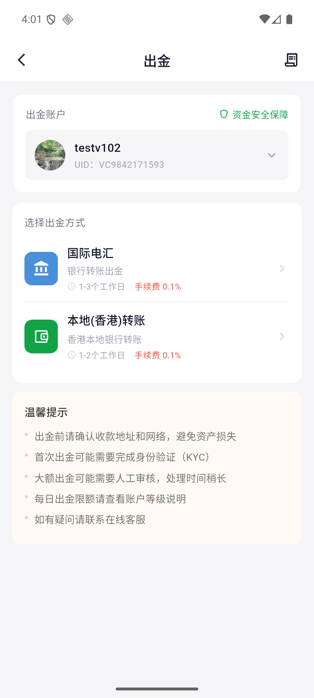
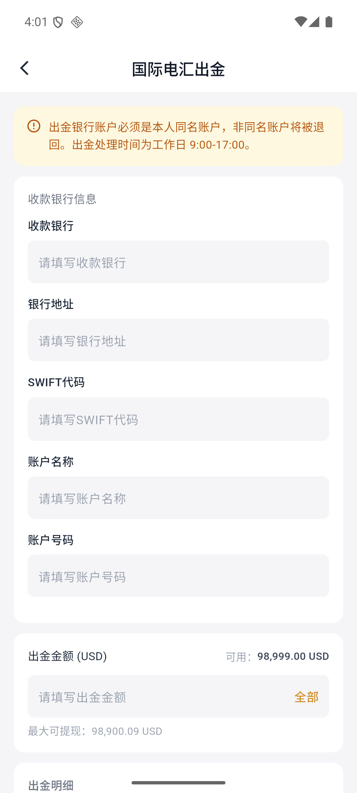
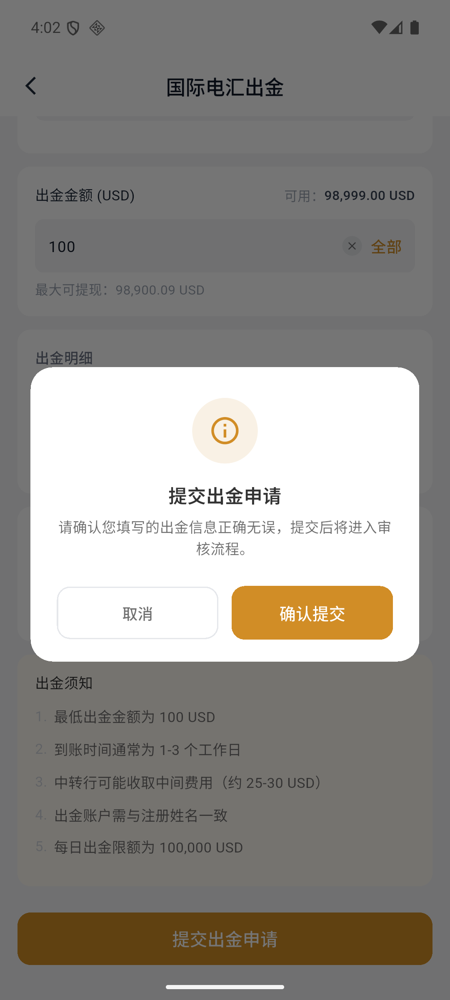

# How to withdraw money via international wire transfer

International wire transfer withdrawal supports withdrawing USD to the bank account with the same name, which usually takes 1–3 working days.

:::warning before starting
The name of the receiving account must be consistent with the name of the Virtu Capital account. International wire transfers may incur intermediary bank fees.
:::

## 1. Select international wire transfer

Open the APP and enter "Assets" at the bottom. After clicking "Withdrawal", confirm the withdrawal account, and then select "International Wire Transfer".

## 2. Fill in the receiving bank information

Fill in the beneficiary bank, bank address, SWIFT code, account name and account number in order.

## 3. Fill in the withdrawal amount

Enter the withdrawal amount, or click "All" to fill in the maximum withdrawal amount. The page will automatically calculate the handling fee and the total amount actually deducted from the account.

The minimum withdrawal amount for international wire transfer is 100 USD, and the handling rate shown on the page is 0.1%.

## 4. Confirm and submit

Click "Submit Withdrawal Application", confirm again that the information filled in is correct, and then click "Confirm Submission".

## 5. Save application number

The submission success page will display the estimated arrival time, application number and submission time. It is recommended to keep the application number for easy reference.

## 6. Check withdrawal status

Click "Withdrawal Record" from the success page, or enter the record page from the upper right corner of the withdrawal page. Records support filtering by withdrawal method, review status and payment status.

Common statuses include:

| Status Type | Common Status |
| --- | --- |
| Review status | Pending review, passed, rejected |
| Payment status | Pending payment, payment completed, payment failed |

