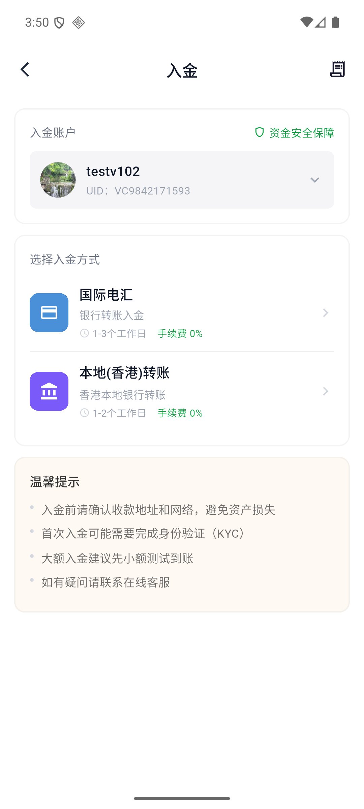
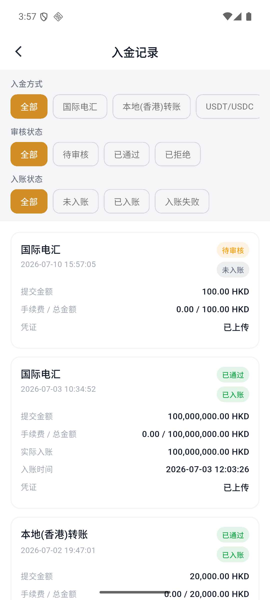

# 如何通過國際電匯入金

國際電匯支持以 HKD 或 USD 入金。提交匯款憑證後，平臺通常需要 1–3 個工作日完成審覈與入賬。

:::info 開始前
請使用開戶人本人的同名銀行賬戶匯款。最低入金金額爲 100 HKD 或 100 USD。
:::

## 1. 選擇國際電匯

打開 APP，進入底部的“資產”。點擊“入金”後，確認入金賬戶和 UID，再選擇“國際電匯”。

## 2. 填寫入金金額

選擇 HKD 或 USD，並輸入入金金額。檢查手續費和總金額無誤後，點擊“去電匯”。

## 3. 查看收款銀行信息

頁面會展示收款銀行、銀行地址、SWIFT 代碼、賬戶名稱和賬戶號碼。請按照頁面信息從您的銀行發起電匯。

:::warning 匯款注意事項
匯款備註中應填寫您的 Virtu Capital 賬戶 ID。中轉行可能另外收取費用，實際收費以匯出銀行爲準。
:::

## 4. 上傳匯款憑證

完成銀行匯款後點擊“我已完成匯款”。您可以拍照或從相冊選擇一張電匯回單或轉賬成功截圖。

選擇圖片後檢查預覽。如果圖片不正確，可以重新拍照、重新選擇或刪除圖片。

## 5. 提交審覈

點擊“提交審覈”。提交成功頁會顯示預計到賬時間、申請編號和提交時間。

## 6. 查看入金狀態

點擊“查看入金記錄”，或從入金頁面右上角進入“入金記錄”。記錄支持按入金方式、審覈狀態和入賬狀態篩選。

常見狀態包括：

| 狀態類型 | 常見狀態 |
| --- | --- |
| 審覈狀態 | 待審覈、已通過、已拒絕 |
| 入賬狀態 | 未入賬、已入賬、入賬失敗 |

