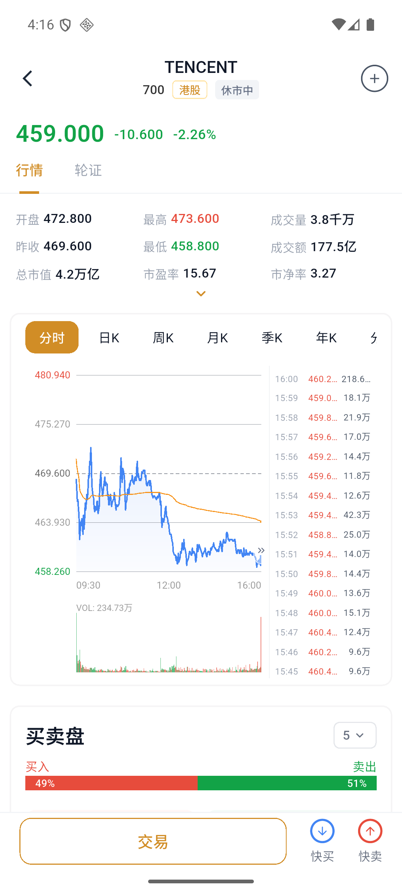
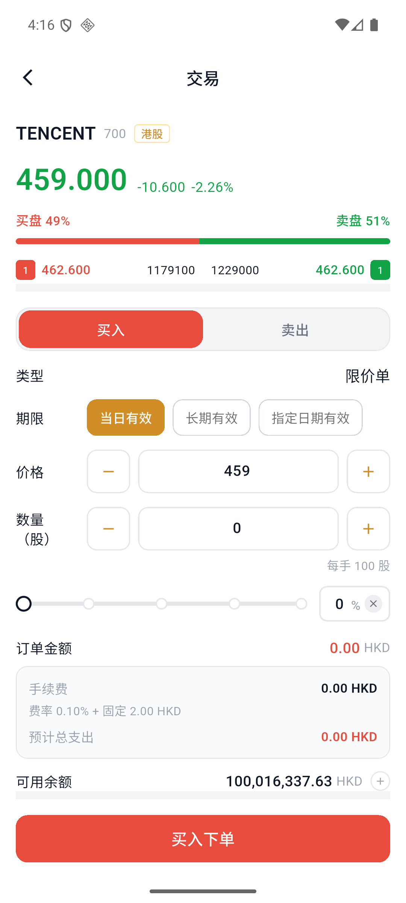

# 如何買入和賣出股票

## 開始前

- 確認賬戶已完成開戶並有足夠的對應幣種餘額。
- 港股通常按每手股數交易，訂單頁會顯示“每手”數量。
- 限價單隻限定成交價格，不保證一定成交。

## 1. 找到股票

進入“市場”或“自選”，搜索股票代碼或名稱，也可以從熱門股票列表進入。點擊股票後進入行情詳情頁。

## 2. 進入交易頁

點擊底部“交易”。如果只需要快速下單，也可以選擇“快買”或“快賣”。

## 3. 選擇買入或賣出

在訂單頁選擇“買入”或“賣出”，然後確認：

| 字段 | 說明 |
| --- | --- |
| 訂單類型 | 當前頁面爲限價單 |
| 有效期 | 當日有效、長期有效或指定日期有效 |
| 價格 | 買入時表示願意支付的最高價格；賣出時表示願意接受的最低價格 |
| 數量 | 輸入股數，並留意每手股數要求 |

## 4. 檢查金額和費用

提交前檢查訂單金額、手續費、預計總支出和可用餘額。

:::warning 限價單不保證成交
買入限價單隻會按指定價格或更低價格成交；賣出限價單隻會按指定價格或更高價格成交。如果市場沒有達到限價，訂單可能保持“已提交”或到期未成交。
:::

## 5. 提交訂單

點擊“買入下單”或“賣出下單”。看到下單成功提示後，點擊“確認”。

## 6. 查看訂單狀態

進入“資產”，點擊“訂單”。可以使用狀態、買賣方向和訂單類型篩選，也可以搜索訂單號、股票代碼和股票名稱。

訂單列表會顯示訂單價格、股數、金額、已成交數量和當前狀態。

### 常見狀態

- 已提交：訂單已經進入系統，尚未全部成交。
- 已成交：訂單股數已經全部成交。
- 部分成交：只有部分股數成交，剩餘部分仍可能繼續等待成交。
- 已取消：訂單已經撤銷，不會繼續成交。
